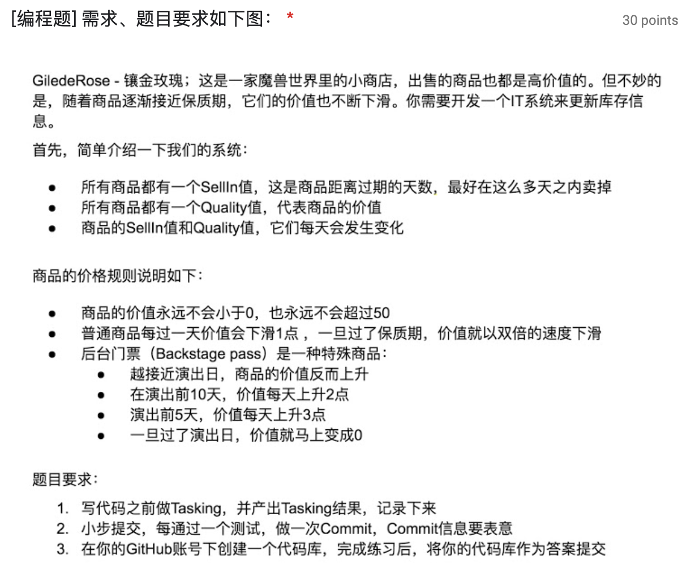

## GiledeRose

Task:

- [ ] 普通商品能够更新价值信息
- [ ] 后台门票商品能够更新价值信息
  - [ ] 普通商品价值小于等于0时不能继续减少
  - [ ] 普通商品门票在过保质期之前每天下滑1
  - [ ] 普通商品门票在过保质期后每天双倍下滑
  - [ ] 后台门票商品价值大于等于50时不能继续增加
  - [ ] 后台门票商品在演出前价值会上升
  - [ ] 后台门票商品在演出前10天每天价值上升2
  - [ ] 后台门票商品在演出前5天每天价值上升3
  - [ ] 后台门票商品在演出后价值变为0
- [ ] 普通商品能够更新剩余过期时间
- [ ] 后台门票商品能够更新剩余过期时间
  - [ ] 剩余过期时间能够每天减少1